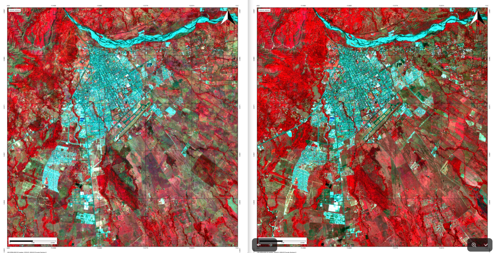

# GeoTimeLapse Documentation

Welcome to **GeoTimeLapse**! A **QGIS** plugin that allows you to visualize the changes in a selected area over time using satellite data.

## Getting Started

In this documentation, you will find step-by-step instructions on how to:
- Set up the plugin.
- Select and configure satellite images.
- Generate time-lapse animations.

Follow the steps in the guide to get started with the plugin!

If you have any questions or need further assistance, visit the 
<a href="https://github.com/Cristian-Blanco/Geo-Time-Lapse" target="_blank" rel="noopener noreferrer">
GitHub repository
</a>
for more resources and support.

## Result

