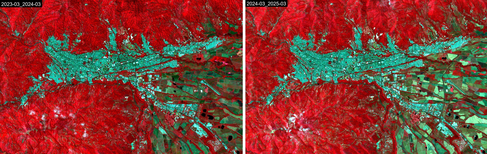

# Documentación de GeoTimeLapse

¡Bienvenido a **GeoTimeLapse**! Un complemento para **QGIS** que te permite visualizar los cambios de una zona seleccionada a lo largo del tiempo usando datos satelitales.

## Comenzando

En esta documentación, encontrarás instrucciones paso a paso sobre cómo:

- Configurar el complemento.
- Seleccionar y configurar las imágenes satelitales.
- Generar animación del cambio temporal.

¡Sigue los pasos de la guía para comenzar a usar el complemento!

Si tienes alguna pregunta o necesitas más ayuda, visita el [repositorio en GitHub](https://github.com/Cristian-Blanco/Geo-Time-Lapse) para más recursos y soporte.

## Resultado

