# Quick Guide

This guide will walk you step by step through the process of setting up and generating a sequence of satellite images using the **GeoTimeLapse** plugin in QGIS.

## Step 1: Log in to the Plugin

1. Open the plugin in QGIS.
2. Click the **Log in with Google** button.
3. Follow the steps to authenticate with your Google account.

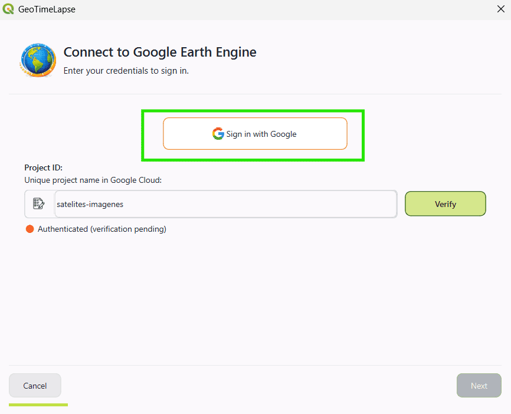

## Step 2: Obtain Your Google Earth Engine Project ID

1. To use the plugin, you need a **Project ID** provided by Google Earth Engine.
   
2. If you don't have a Google Earth Engine account or haven't created a project, follow these steps:

#### Create a Google Earth Engine Account
   - Go to the following link: [Google Earth Engine Signup](https://signup.earthengine.google.com/)
   - Complete the form with your information to request access.
   - Once your request is accepted, you'll be able to access the Google Earth Engine console.

#### Register Your Project in Google Cloud
   - Go to the Google Cloud Console: [Google Cloud Console](https://console.cloud.google.com/).
   - Navigate to the **Google Earth Engine** section within Google Cloud.
   - In the **Configuration** section, you will see two options:
     - Commercial use
     - Non-commercial use

   - After registering your project, you'll be able to obtain your **Project ID**.
   - Once registered, go to the Google Earth Engine console: [https://code.earthengine.google.com/](https://code.earthengine.google.com/).
   - In the console, create a new project.
   - The **Project ID** will be displayed at the top of the project interface in the configuration options.

*Note:* If you already have a **Project ID**, simply access the console and get your project ID.

**Additional Reference:**

- For more details on working with Google Earth Engine, you can check the official documentation here: [Google Earth Engine Docs](https://developers.google.com/earth-engine).

## Step 3: Set the Project ID in GeoTimeLapse

1. In the plugin window, you'll find a field called **Project ID**.
2. Enter your **Project ID** from Google Earth Engine (the unique ID you obtained in the Google Cloud console).
   - Example: `satellite-images`
3. After entering the **Project ID**, click the **Verify** button.
4. The system will check if the **Project ID** is valid and if the authentication with Google Earth Engine was successful.
5. After the verification, you can continue with the setup process.

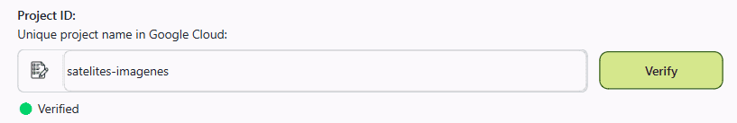

## Step 4: Select the Configuration

1. Once the **Project ID** and authentication are verified, you will be prompted to select the plugin configuration.
2. Currently, only the **Basic** option is available.
3. Select the **Basic** option.

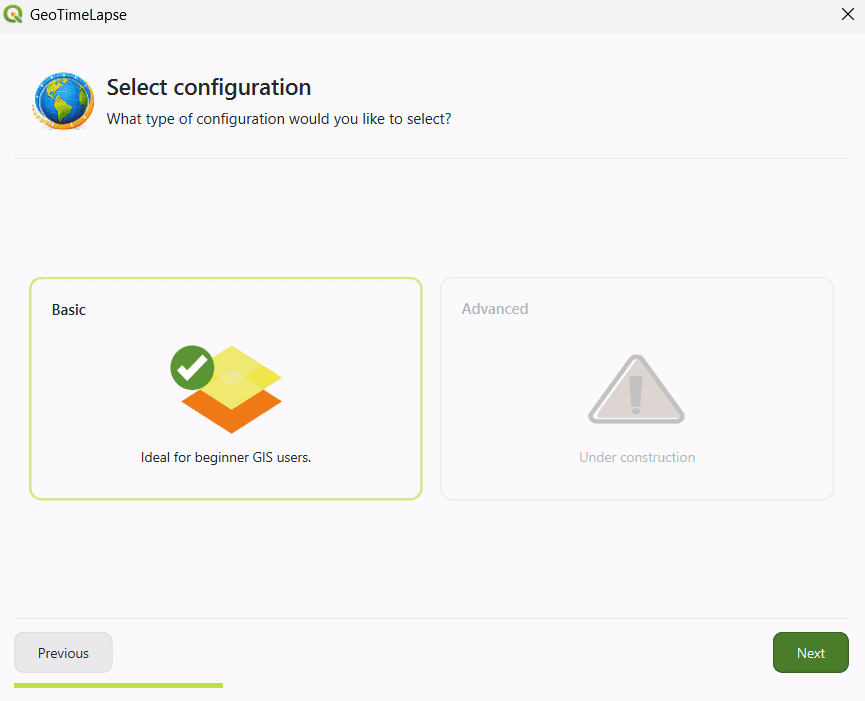

## Step 5: Select the Satellite Image Type

1. Three image filters will be presented to you, depending on the type of visualization you need:

      - **Natural Color**: Ideal for general visualization.

      - **Infrared**: Useful for detecting changes in vegetation, soil, and land cover.
      
      - **Radar**: Perfect for identifying areas with high cloud coverage.

2. On the right panel, you will be explained when to use each filter.

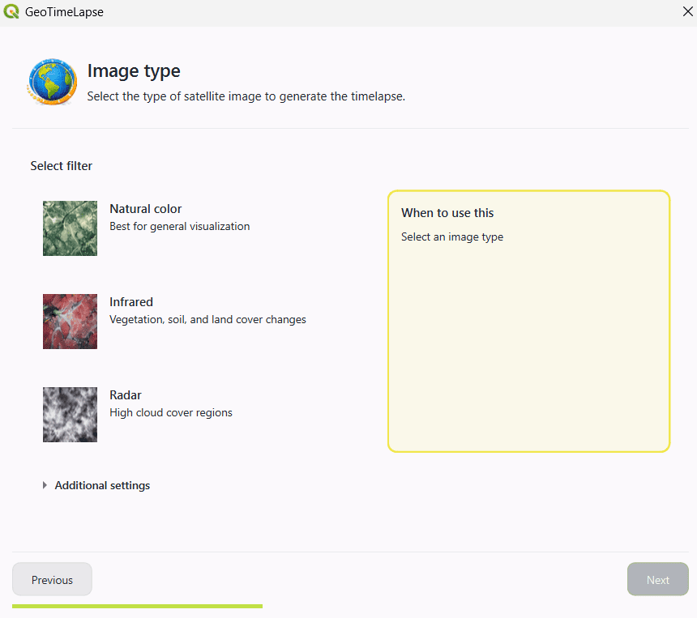

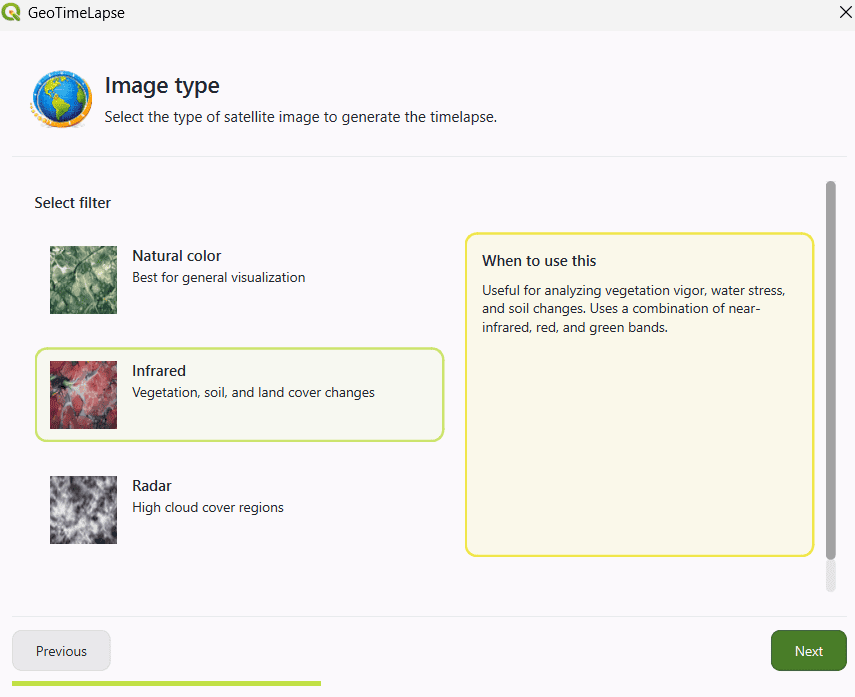

#### Additional Configurations

If you want to modify some aspects of the image, you can access the **Additional Configurations**. These options allow you to further customize the visualization:

- **Image Normalization**: Leave this option selected if you want the image to highlight land cover more. This helps improve the visualization of terrain changes.
- **Select Satellite**: Choose the satellite from which the image will be taken.
- **Image Composition**:

     - **Median**: Uses the median of available images to create the composition.
     
     - **Mosaic**: Combines multiple images to create a composite image.
     
     - **Single**: Uses the first image that meets the cloud percentage criteria of the selected satellite.

- **Cloud Percentage**: This percentage refers to the cloud coverage in the entire satellite image, not just in the selected area. In some cases, the entire image might meet the cloud percentage, but the selected area could have more clouds than expected.

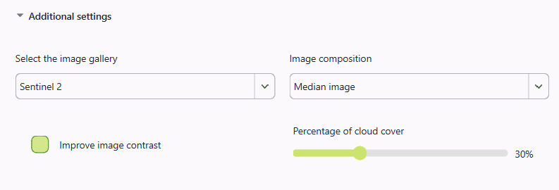

## Step 6: Select the Area to Visualize

1. Click the **Select an area on the map** button.

2. This will allow you to directly select the area on the QGIS map that you want to visualize over time. You can click and drag to define the area of interest.

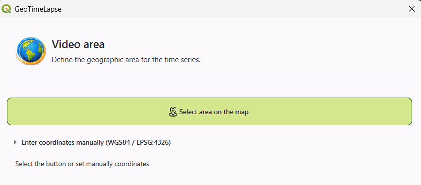

3. **Use reference tools** (optional):
   
      - If desired, you can use tools like **Map Quick Service** to obtain reference maps and ensure you're selecting the correct region.

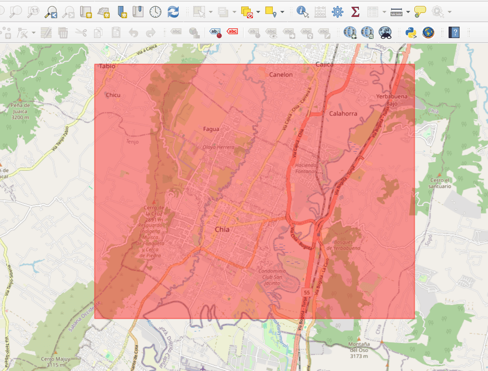

4. **Enter coordinates manually**:
      - If you prefer to define the area using coordinates, you can manually enter the coordinates in **WGS84 (EPSG:4326)**.
      
      - Enter the coordinates of the two points that define the area of interest:

         - **Point 1**: Coordinates of the top-left corner (latitude and longitude).

         - **Point 2**: Coordinates of the bottom-right corner (latitude and longitude).

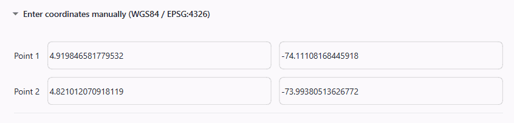

## Step 7: Select the Time Period

1. Select the time range for the temporal intervals:

     - **Start Date**: Choose the date you want the visualization to start from.
     - **End Date**: Select the date you want the visualization to end.

2. **Time Interval**:
      - You can choose the time interval between each image. The options are:

         - **3 months**
         - **6 months**
         - **1 year** (recommended)
         - **2 years**
   
      - The system will generate images at a fixed time interval, depending on what you select. For example:
      
      - If you select **1 year**, the system will generate at least one image per year within the chosen date range. The images will be generated for each date that fits that interval (one image in 2017, another in 2018, and so on).

3. **Frame Duration**:
   
      - Here you can set how long each displayed satellite image will last. The default value is **1 second**, but you can adjust it to your preference.

4. In the summary, details such as the image type, selected satellite, and maximum cloud percentage will be displayed.

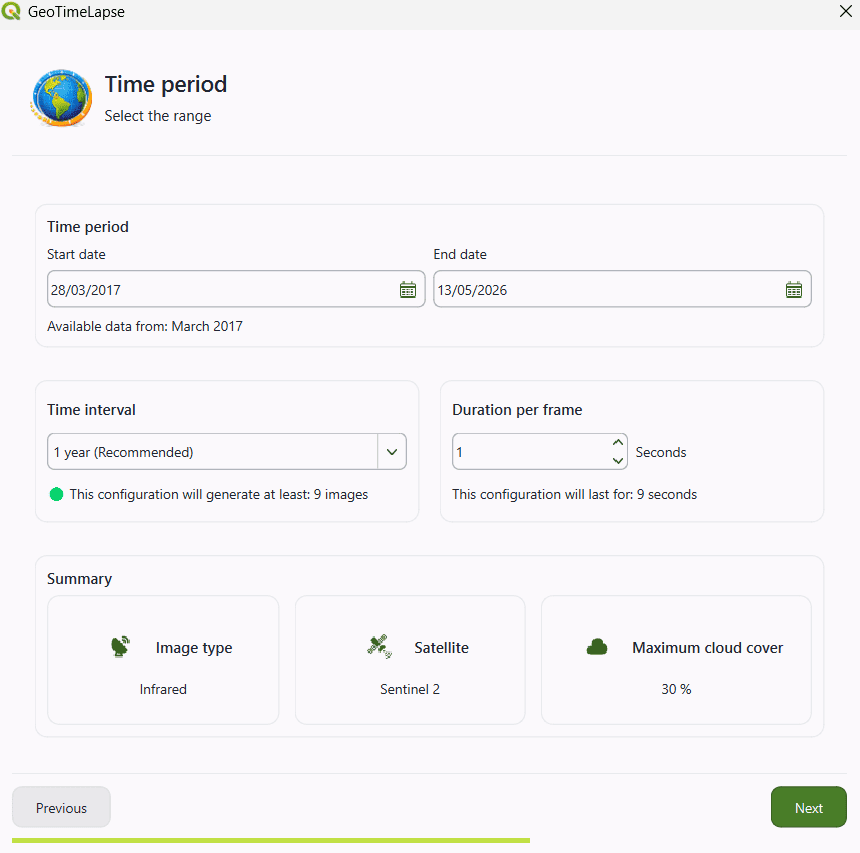

## Step 8: Select the Template for the Animation

1. The chosen template will determine how the images are presented in the video.

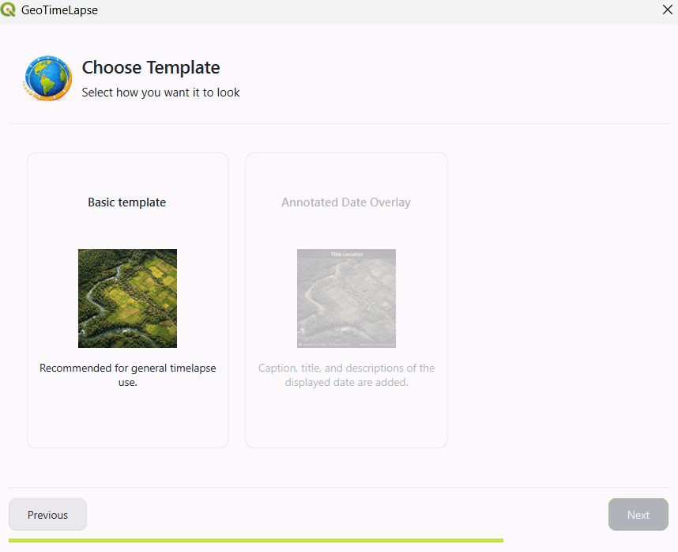

## Step 9: Select the Output Directory

1. Click the directory icon to select the destination folder.

## Step 10: Create the Video

1. Once everything is configured, the system will begin processing the information and generating the video.
2. You will see a progress indicator showing the percentage of completion.

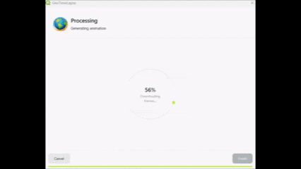

3. When the process is finished, you can click **Finish**.

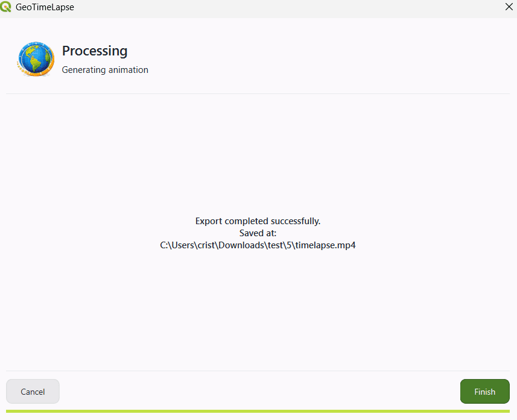
