# Guía rápida

Esta guía te llevará paso a paso a través del proceso de configuración y generación de una secuencia de imágenes satelitales utilizando el plugin GeoTimeLapse en QGIS.

## Paso 1: Iniciar sesión en el plugin

1. Abre el plugin en QGIS.
2. Haz clic en el botón **Iniciar sesión con Google**.
3. Sigue los pasos para autenticarte con tu cuenta de Google.

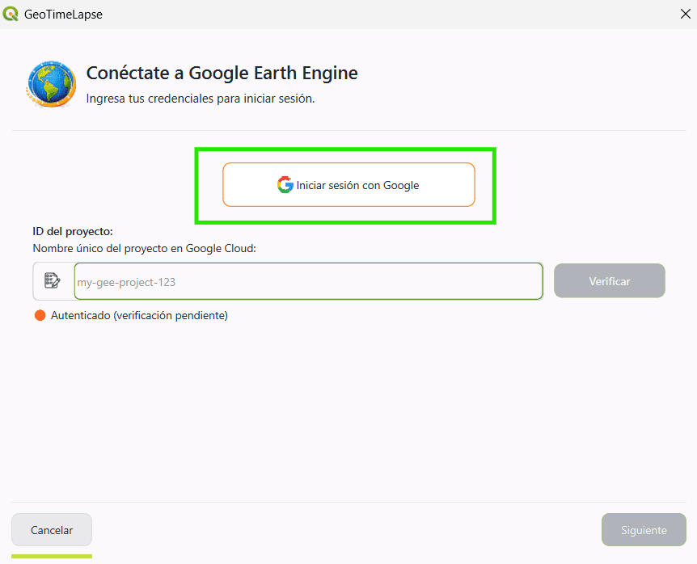

## Paso 2: Obtener tu Project ID de Google Earth Engine

1. Para utilizar el plugin, necesitas un **Project ID** otorgado por Google Earth Engine.
   
2. Si aún no tienes una cuenta de Google Earth Engine o no has creado un proyecto, sigue estos pasos:

#### Crear una cuenta de Google Earth Engine
   - Dirígete al siguiente enlace: [Google Earth Engine Signup](https://signup.earthengine.google.com/)
   - Completa el formulario con tus datos para solicitar acceso.
   - Una vez aceptada tu solicitud, podrás acceder a la consola de Google Earth Engine.

#### Registrar tu proyecto en Google Cloud
   - Accede a la consola de Google Cloud: [Google Cloud Console](https://console.cloud.google.com/).
   - Ve a la sección de **Google Earth Engine** dentro de Google Cloud.
   - En la sección **Configuration**, verás dos opciones:
     - Uso comercial
     - Uso no comercial
   - Después de registrar tu proyecto, podrás obtener tu **Project ID**.
   - Una vez registrado, accede a la consola de Google Earth Engine: [https://code.earthengine.google.com/](https://code.earthengine.google.com/).
   - En la consola, crea un nuevo proyecto.
   - El **Project ID** se mostrará en la parte superior de la interfaz del proyecto, en las opciones de configuración.

*Nota:* Si ya tienes un **Project ID**, simplemente accede a la consola y obtén el ID del proyecto.

**Referencia adicional:**

- Para más detalles sobre cómo trabajar con Google Earth Engine, puedes consultar la documentación oficial aquí: [Google Earth Engine Docs](https://developers.google.com/earth-engine).

## Paso 3: Establecer el Project ID en GeoTimeLapse

1. En la ventana del plugin, encontrarás un campo llamado **Project ID**.
2. Escribe tu **Project ID** de Google Earth Engine (el ID único del proyecto que obtuviste en la consola de Google Cloud).
   - Ejemplo: `satelites-imagenes`
3. Una vez ingresado el **Project ID**, haz clic en el botón **Verificar**.
4. El sistema verificará si el **Project ID** es válido y si la autenticación con Google Earth Engine ha sido exitosa.
5. Después de la verificación, podrás continuar con el proceso de configuración.

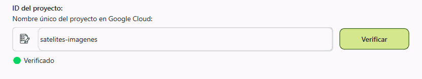

## Paso 4: Seleccionar la configuración

1. Una vez que hayas verificado el **Project ID** y la autenticación, se te pedirá seleccionar la configuración del plugin.
2. Actualmente, solo está disponible la opción **Básico**.
3. Selecciona la opción **Básico**.

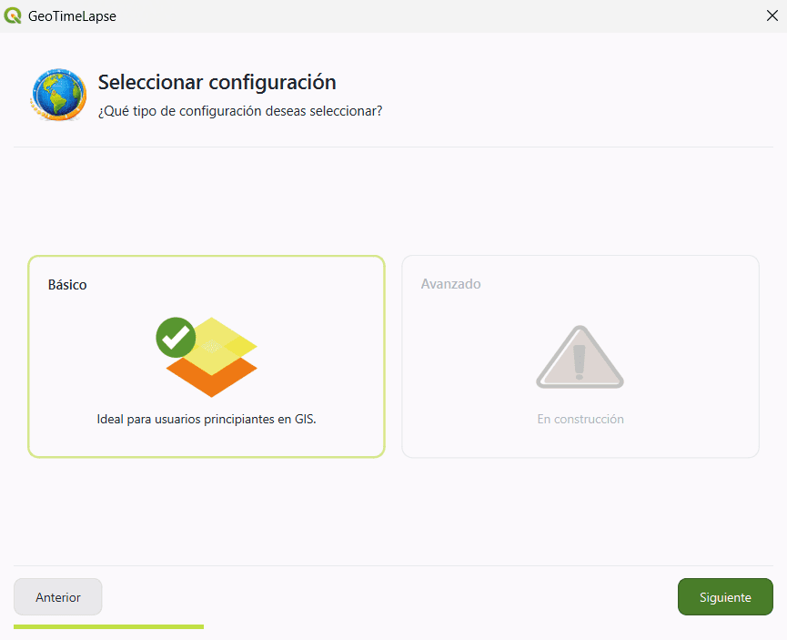

## Paso 5: Seleccionar el tipo de imagen satelital

1. Se te presentarán tres filtros de imagen que puedes seleccionar según el tipo de visualización que necesites:

      - **Color natural**: Ideal para una visualización general.

      - **Infrarrojo**: Útil para detectar cambios en vegetación, suelos y coberturas del terreno.
      
      - **Radar**: Perfecto para identificar regiones con alta cobertura de nubes.

2. En el panel derecho, se te explicará cuándo usar cada tipo de filtro.

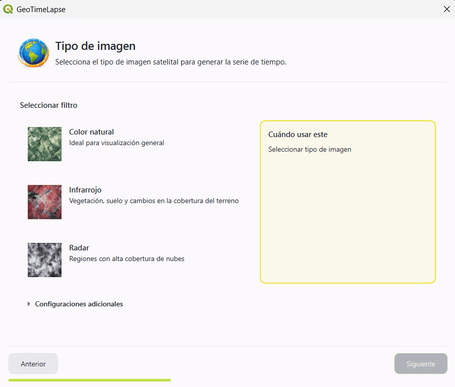

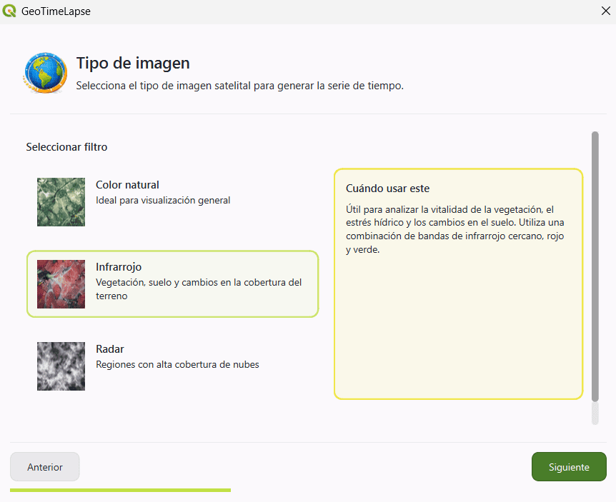

#### Configuraciones adicionales

Si deseas modificar algunos aspectos de la imagen, puedes acceder a las **Configuraciones adicionales**. Estas opciones te permiten personalizar aún más la visualización:

- **Normalización de la imagen**: Deja esta opción seleccionada si deseas que la imagen resalte más las coberturas. Esto ayuda a mejorar la visualización de cambios en el terreno.
- **Seleccionar satélite**: Elige el satélite desde el cual se tomará la imagen.

- **Composición de la imagen**:

     - **Mediana**: Utiliza la mediana de las imágenes disponibles para crear la composición.
      
     - **Mosaico**: Combina varias imágenes para crear una imagen compuesta.
      
     - **Único**: Utiliza la primera imagen que cumpla con el porcentaje de nubosidad del satélite seleccionado.

- **Porcentaje de nubosidad**: Este porcentaje se refiere a la nubosidad en toda la imagen satelital, no solo en el área seleccionada. En algunos casos, es posible que la imagen completa cumpla con el porcentaje de nubosidad, pero la zona seleccionada tenga más nubes de las esperadas.

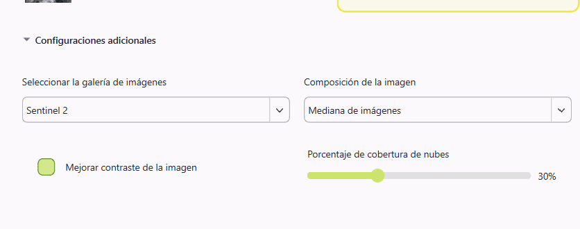

## Paso 6: Seleccionar el área de visualización

1. Haz clic en el botón **Selecciona un área en el mapa**.
2. Esto te permitirá seleccionar directamente el área en el mapa de QGIS que deseas ver a lo largo del tiempo. Puedes hacer clic y arrastrar para definir el área que te interesa.

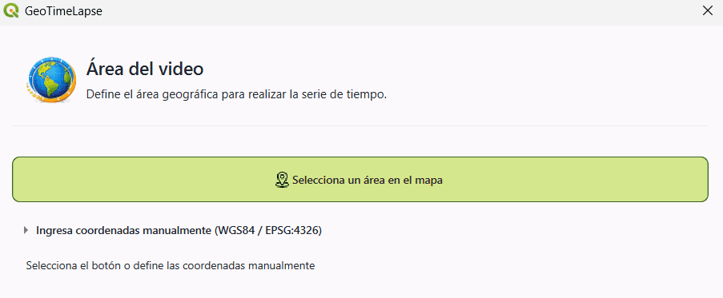

3. **Usar herramientas de referencia** (opcional):
       
      - Si lo deseas, puedes utilizar herramientas como **Map Quick Service** para obtener mapas de referencia y asegurarte de que estás seleccionando la región correcta.

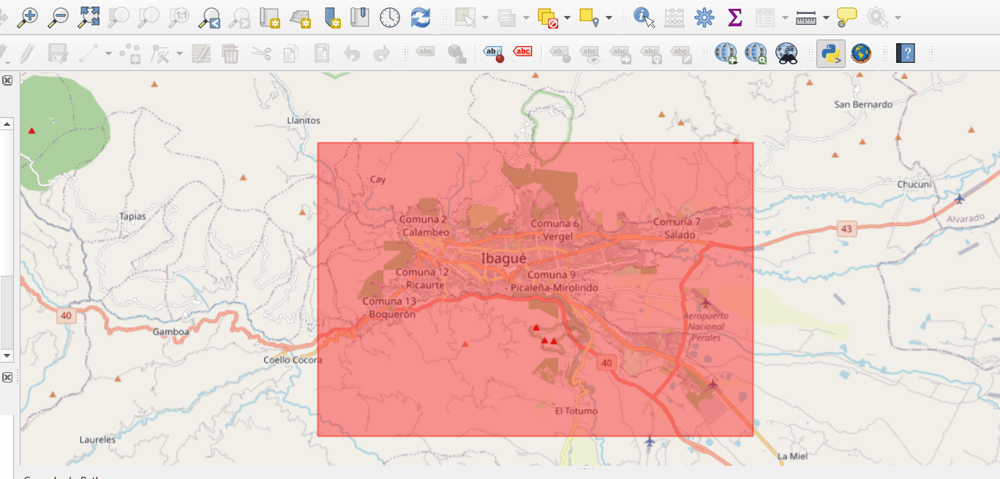

4. **Ingresar coordenadas manualmente**:

     - Si prefieres definir el área mediante coordenadas, puedes ingresar las coordenadas manualmente en el sistema de referencia **WGS84 (EPSG:4326)**.

     - Debes ingresar las coordenadas de los dos puntos que definen el área de interés:

          - **Punto 1**: Coordenadas de la parte superior izquierda (latitud y longitud).
          - **Punto 2**: Coordenadas de la parte inferior derecha (latitud y longitud).

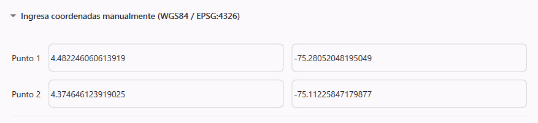

## Paso 7: Seleccionar el período de tiempo

1. Debes seleccionar el rango de tiempo para los saltos temporales:
     - **Fecha de inicio**: Elige la fecha en la que quieres que comience la visualización.
    
     - **Fecha de finalización**: Selecciona el día en el que deseas que termine la visualización.

2. **Intervalo de tiempo**:

     - Puedes escoger el intervalo de tiempo entre cada 
     imagen. Las opciones son:
           - **3 meses**
           - **6 meses**
           - **1 año** (recomendado)
           - **2 años**
     - El sistema generará imágenes tomando un intervalo de tiempo fijo, según lo que selecciones. Por ejemplo:
           
           - Si seleccionas **1 año**, el sistema generará al menos una imagen por año dentro del rango de fechas elegido. Se generarán imágenes para cada fecha que cumpla con ese intervalo (una imagen en 2017, otra en 2018, y así sucesivamente).

3. **Duración por frame**:

      - Aquí puedes establecer cuánto durará cada imagen satelital presentada. El valor por defecto es **1 segundo**, pero puedes ajustarlo según tu preferencia.

4. En el resumen, se te mostrarán detalles como el tipo de imagen, satélite seleccionado y el porcentaje máximo de nubosidad.

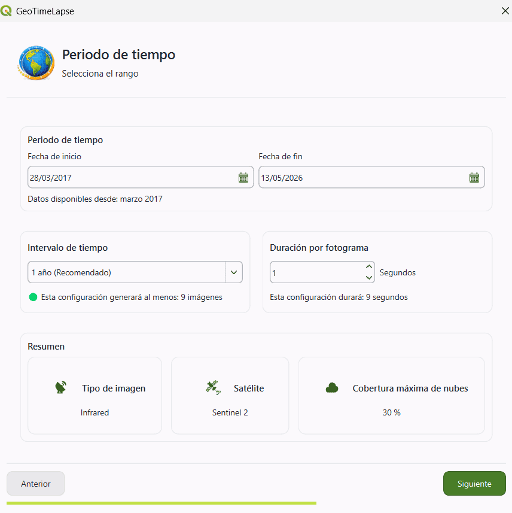

## Paso 8: Seleccionar la plantilla

1. La plantilla elegida determinará cómo se presentarán las imágenes en el video.

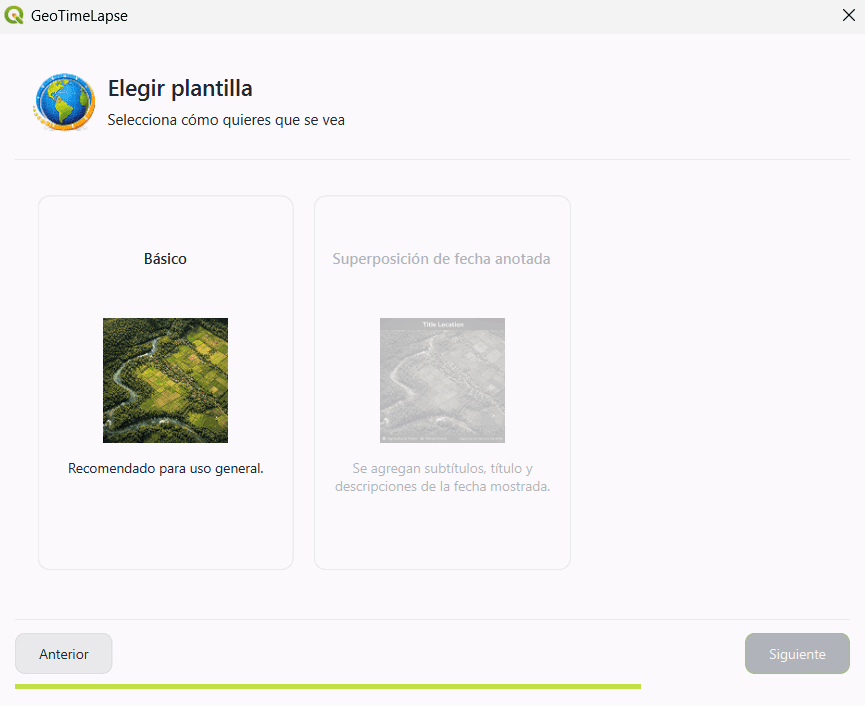

## Paso 9: Seleccionar el directorio de salida

1. Haz clic en el icono de directorio para elegir la carpeta de destino.

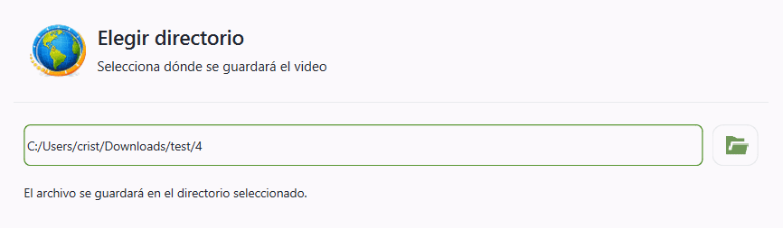

## Paso 10: Creación del video

1. Una vez que hayas configurado todo, el sistema comenzará a procesar la información y generar el video.
2. Verás un indicador de progreso mostrando el porcentaje de avance.
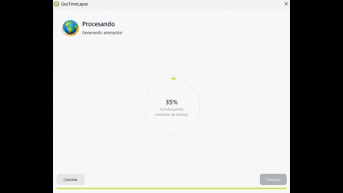

3. Cuando el proceso haya terminado, podrás hacer clic en **Finalizar**.

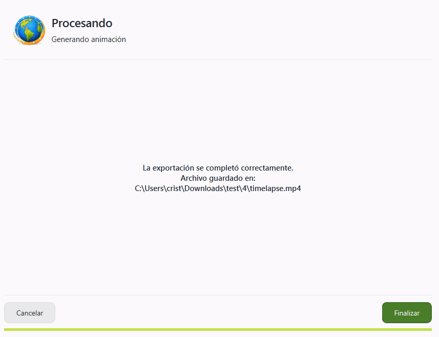
