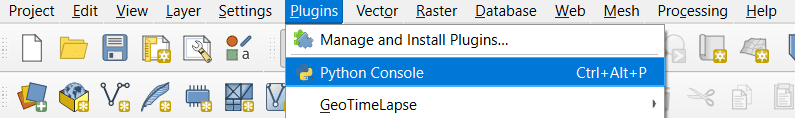
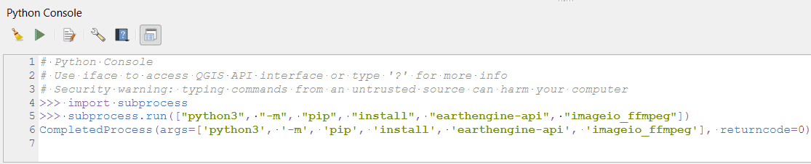

# Setup

To use **GeoTimeLapse** with Google Earth Engine and generate animations, you need to install two essential dependencies:

### Required Dependencies:

1. **`earthengine-api`**: This library allows you to access and work with **Google Earth Engine** data from Python.
2. **`imageio_ffmpeg`**: This is used to generate animations from the satellite images obtained.

Both libraries are necessary to interact with Google Earth Engine data and create the animation.

### Installing Dependencies via QGIS

Although you can install these dependencies in any Python environment, here’s how to do it using **QGIS**:

1. **Open QGIS**.
2. **Open the Python terminal** in QGIS.

   To open the Python terminal, go to **Plugins** > **Python Console** in QGIS. If you're not using QGIS, open a terminal or Python console in the environment of your choice.



3. In the Python terminal, run the following command to install the necessary dependencies:

```python
import subprocess
subprocess.run(["python3", "-m", "pip", "install", "earthengine-api", "imageio_ffmpeg"])
```


