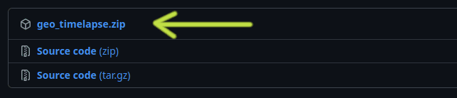
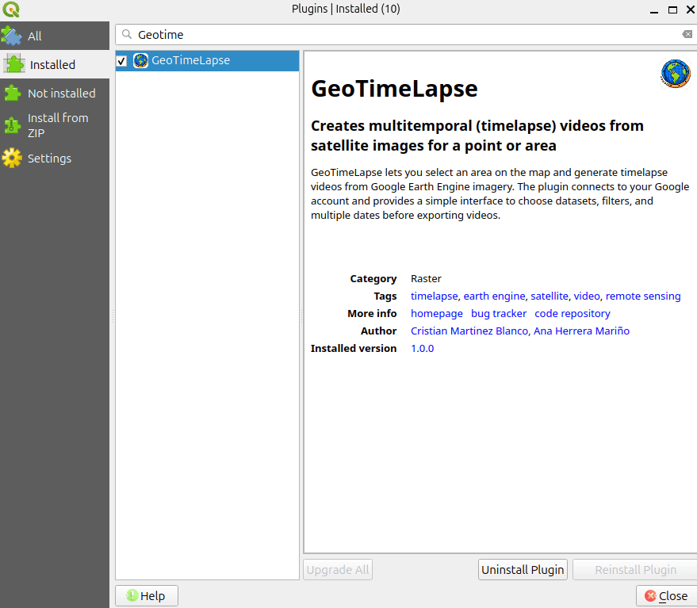
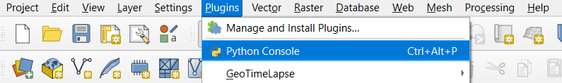
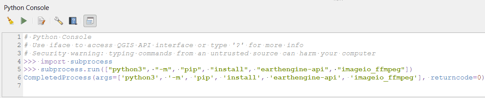

# Installation and Configuration

This section explains how to download, install, and configure **GeoTimeLapse** in QGIS.

> **Compatibility note:** This version is intended for **QGIS 3.x** environments.

## Download the Plugin

Download the latest version of the plugin from the following link:

<a href="https://github.com/Cristian-Blanco/Geo-Time-Lapse/releases/latest" target="_blank" rel="noopener noreferrer">
  Download GeoTimeLapse
</a>



## Install the Plugin in QGIS

1. Open **QGIS**.
2. Go to **Plugins** > **Manage and Install Plugins**.


3. Select the **Install from ZIP** option.
4. Click on **...** and select the downloaded `.zip` file.
5. Click **Install Plugin**.


6. Once the installation is complete, enable the plugin from the list of installed plugins.



## Required Dependencies:

1. **`earthengine-api`**: This library allows you to access and work with **Google Earth Engine** data from Python.
2. **`imageio_ffmpeg`**: This is used to generate animations from the satellite images obtained.

Both libraries are necessary to interact with Google Earth Engine data and create the animation.

### Installing Dependencies via QGIS

Although you can install these dependencies in any Python environment, here’s how to do it using **QGIS**:

1. **Open QGIS**.
2. **Open the Python terminal** in QGIS.

   To open the Python terminal, go to **Plugins** > **Python Console** in QGIS. If you're not using QGIS, open a terminal or Python console in the environment of your choice.



3. In the Python terminal, run the following command to install the necessary dependencies:

In the Python terminal, import subprocess to run system commands:
```python
import subprocess
```

Then install the required libraries:
```python
subprocess.run(["python3", "-m", "pip", "install", "earthengine-api", "imageio_ffmpeg"])
```


