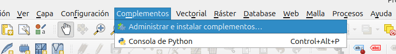
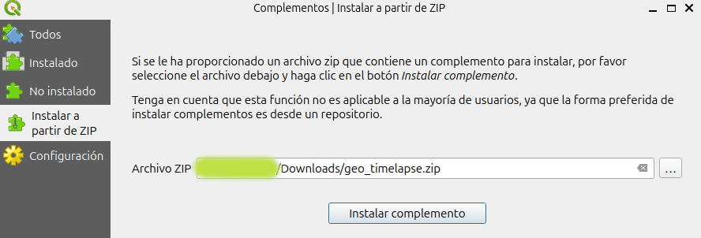
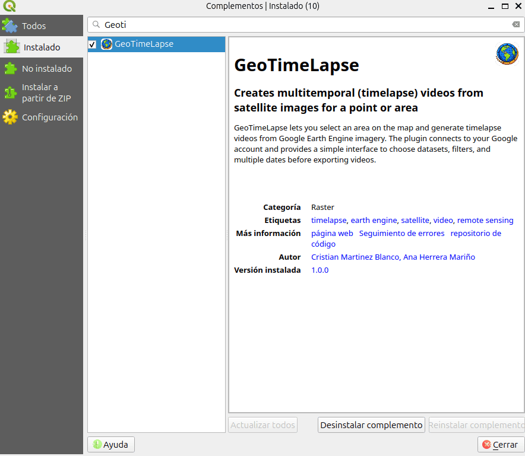
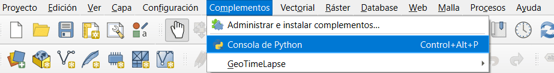
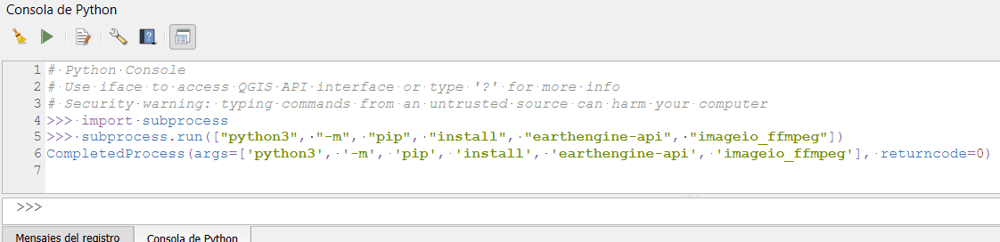

# Instalación y configuración

Esta sección explica cómo descargar, instalar y configurar **GeoTimeLapse** en QGIS.

> **Nota de compatibilidad:** Esta versión está orientada a entornos **QGIS 3.x**.

## Descargar el plugin

Descarga la versión más reciente del plugin desde el siguiente enlace:

<a href="https://github.com/Cristian-Blanco/Geo-Time-Lapse/releases/latest" target="_blank" rel="noopener noreferrer">
  Descargar GeoTimeLapse
</a>


## Instalar el plugin en QGIS

1. Abre **QGIS**.
2. Ve al menú **Complementos** > **Administrar e instalar complementos**.



3. Selecciona la opción **Instalar a partir de ZIP**.
4. Haz clic en **...** y selecciona el archivo `.zip` descargado.
5. Haz clic en **Instalar complemento**.



6. Una vez finalizada la instalación, activa el plugin desde la lista de complementos instalados.



## Dependencias necesarias:

1. **`earthengine-api`**: Esta librería te permite acceder y trabajar con datos de **Google Earth Engine** desde Python.
2. **`imageio_ffmpeg`**: Se utiliza para generar animaciones a partir de las imágenes satelitales obtenidas.

Ambas librerías son necesarias para interactuar con los datos de Google Earth Engine y para la creación de la animación.

### Instalar las dependencias a través de QGIS

Aunque puedes instalar estas dependencias en cualquier entorno de Python, a continuación te mostramos cómo hacerlo utilizando **QGIS**:

1. **Abre QGIS**.
2. **Abre la terminal de Python** en QGIS.

   Para abrir la terminal de Python, puedes ir a **Complementos** > **Consola de python** en QGIS. Si no estás usando QGIS, abre una terminal o consola de Python en el entorno que prefieras.



3. En la terminal de Python, ejecuta el siguiente comando para instalar las dependencias necesarias:

```python
import subprocess
subprocess.run(["python3", "-m", "pip", "install", "earthengine-api", "imageio_ffmpeg"])
```


